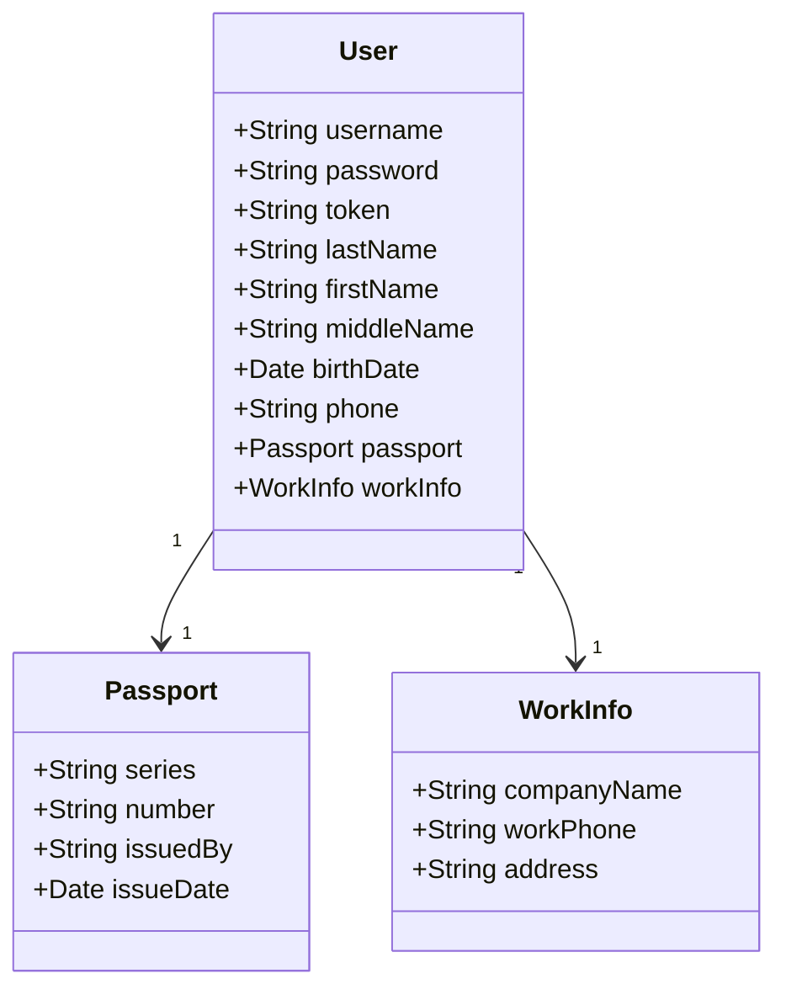

# Тестовое задание Мельникова 

## UML-диаграмма модели User

### Npm-скрипты
#### Установка зависимостей
- `npm install` — установка всех зависимостей проекта

#### Разработка
- `npm run dev` — запуск приложения в режиме разработки (Vite)

#### Анализ кода
- `npm run format` — автоформатирование кода с помощью Prettier
---

#### В качестве хранилища использована реальная база MongoDB

#### Обязательные поля при регистрации пользователя:
- 'username',
- 'password',
- 'lastName',
- 'firstName',
- 'birthDate',
- 'phone',
- 'passport.series',
- 'passport.number',
- 'passport.issuedBy',
- 'passport.issueDate'