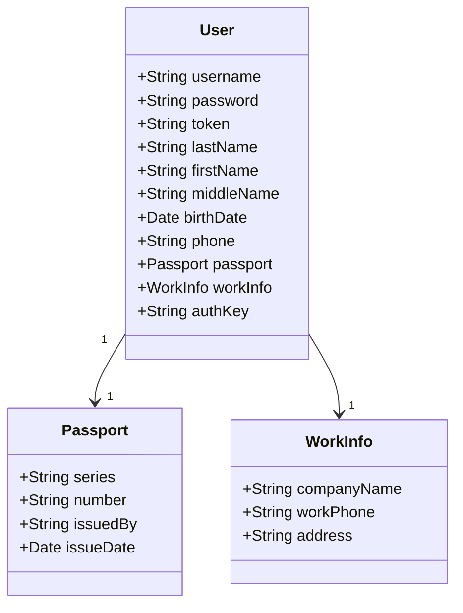

# Мой проект

## UML-диаграмма модели User

```mermaid
classDiagram
    class User {
        +String username
        +String password
        +String token
        +String lastName
        +String firstName
        +String middleName
        +Date birthDate
        +String phone
        +Passport passport
        +WorkInfo workInfo
        +String authKey
    }
       class Passport {
        +String series
        +String number
        +String issuedBy
        +Date issueDate
    }

    class WorkInfo {
        +String companyName
        +String workPhone
        +String address
    }
    User "1" --> "1" Passport
    User "1" --> "1" WorkInfo
```